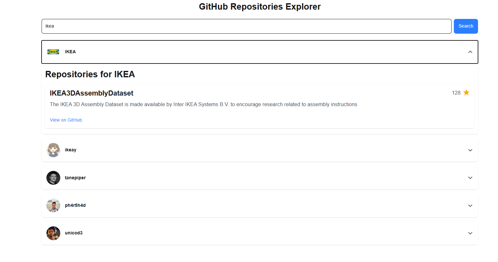
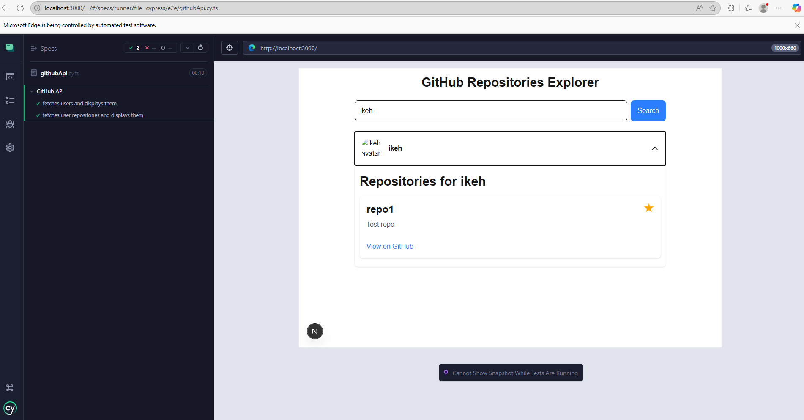

# GitHub Repositories Explorer

A web application built with Next.js to search and explore GitHub users and their repositories. This project uses React, TypeScript, and Cypress for end-to-end and component testing.




## Features

- Search for up to 5 GitHub users by username.
- Responsive design with mobile-first approach using Tailwind CSS.
- Type-safe with TypeScript.
- Global state management with React Context.
- Error handling for API failures.
- Loading states for user and repository searches.
- End-to-end and component testing with Cypress.

## Tech Stack

- **Next.js 14** (App Router, React 19)
- **TypeScript**
- **Tailwind CSS** for styling
- **React Context** for state management
- **Cypress** for testing
- **GitHub API** for data fetching


# Unitest


1. **Clone the repository**:
   ```bash
   git clone https://github.com/your-username/github-repos-explorer.git
   cd github-repos-explorer
   ```

2. **Install dependencies**:
   ```bash
   npm install
   ```

3. **Run the development server**:
   ```bash
   npm run dev
   ```
   Open [http://localhost:3000](http://localhost:3000) in your browser.

4. **Run tests**:
   ```bash
   npm test
   ```
